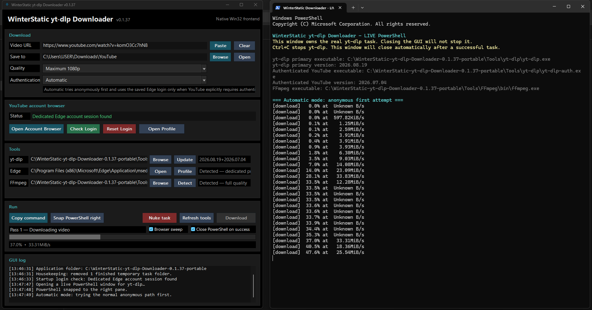

# WinterStatic yt-dlp Downloader

**Version 0.1.37**



WinterStatic yt-dlp Downloader is a native C++17 / Win32 frontend for [`yt-dlp`](https://github.com/yt-dlp/yt-dlp). It provides a compact Windows GUI, FFmpeg support, authenticated YouTube downloads through a dedicated Microsoft Edge profile, and a visible PowerShell task window.

It also adds its own recovery layer. For some pages that yt-dlp cannot handle directly, WinterStatic can scan page metadata and media references, then optionally use a visible browser sweep to find streams exposed at runtime. Recovered media is passed back to yt-dlp for the actual download.

Project: https://github.com/WinterStatic/yt-dlp-WinterStatic

## FEATURES

- Native C++17 / Win32 interface with no Python, Qt, .NET, or other non-system GUI runtime.
- Portable Windows build.
- Quality presets:
  - Best quality
  - Best MP4-compatible
  - Maximum 1080p
  - Maximum 720p
  - Audio only (source format)
- FFmpeg-aware format selection, stream merging, and audio extraction.
- Automatic yt-dlp and FFmpeg setup when building the portable package.
- Separate primary and authenticated yt-dlp backends for YouTube compatibility.
- Authentication modes:
  - Automatic
  - Anonymous
  - Use account browser
- Dedicated Microsoft Edge profile for authenticated YouTube use.
- Retry and recovery handling for common network, format, 403/429, 404, and unsupported URL failures.
- Optional Browser sweep for difficult pages that only expose media during browser activity.
- Visible PowerShell window with the full yt-dlp output.
- Optional Close PowerShell on success setting. Failed tasks stay open for inspection.
- Nuke task control for terminating the currently tracked PowerShell / yt-dlp process tree.
- Dynamic GUI pass reporting for video, audio, assembly, and post-processing work.
- Persistent `settings.ini`.

## BUILD KIT

- `main.cpp` - Native Win32 frontend source.
- `resource.rc` - Application icon and Windows version metadata.
- `app.manifest` - Windows application identity, DPI awareness, Common Controls, and long-path declarations.
- `app.ico` / `app-arrow-transparent.png` - Application icon and source artwork.
- `build-native.bat` - Builds the frontend and prepares the portable package.
- `yt-dlp_winterstatic.png` - Screenshot used by this README.
- `settings.ini` - Clean settings template.
- `LICENSE` - MIT license for the frontend source.
- `THIRD-PARTY-NOTICE.txt` - Notes for yt-dlp, FFmpeg, Microsoft Edge use, and redistribution.
- `PUBLIC-RELEASE-CHECKLIST.md` - Release checklist.
- `.gitignore` - Excludes build outputs, generated packages, local tools, browser data, and IDE files.

## BUILD REQUIREMENTS

- Windows 10 or Windows 11.
- Visual Studio 2022 Build Tools or Visual Studio 2022 with the **Desktop development with C++** workload.
- Windows SDK / `rc.exe`.
- Internet access when the build needs to download or refresh yt-dlp or FFmpeg.

The frontend itself links only against Windows system libraries.

## BUILDING

Run:

```text
build-native.bat
```

A successful build creates:

```text
WinterStatic-yt-dlp-Downloader-0.1.37-portable
```

For a GitHub release, run:

```text
build-native.bat release
```

Release mode also creates:

```text
WinterStatic-yt-dlp-Downloader-0.1.37-portable.zip
WinterStatic-yt-dlp-Downloader-0.1.37-source.zip
```

The source ZIP contains the public frontend source, resources, build files, documentation, and screenshot. It does not include `Tools`, browser profile data, downloaded media, or generated build output.

The build uses the latest official stable yt-dlp for the primary backend. The authenticated YouTube backend normally uses the same stable release, except for versions on the authenticated-quality blacklist. Version `2026.08.19` is currently blacklisted for authenticated YouTube, so the authenticated backend falls back to `2026.07.04` while that release remains relevant.

If FFmpeg is not already available in the portable tools tree, the build downloads the Gyan FFmpeg release essentials package.

## PORTABLE LAYOUT

```text
WinterStatic-yt-dlp-Downloader.exe
settings.ini
README.txt
LICENSE
BUILD-INFO.txt
THIRD-PARTY-NOTICE.txt
Tools\
  yt-dlp\
    yt-dlp.exe
    yt-dlp-auth.exe
  BrowserProfile\
    Default\
  FFmpeg\
    bin\
      ffmpeg.exe
```

Microsoft Edge itself is not bundled. WinterStatic uses the Edge installation already present on Windows.

## AUTHENTICATION

The account browser uses a dedicated Edge data directory:

```text
Tools\BrowserProfile\
```

This is separate from the user's normal Edge profile.

Typical setup:

1. Click **Open Account Browser**.
2. Sign into YouTube / Google in the WinterStatic Edge window.
3. Close that WinterStatic Edge window.
4. Click **Check Login**.
5. Leave Authentication on **Automatic**, or choose **Use account browser** to force the saved session.

Authentication modes:

- **Automatic** - Starts anonymously. If YouTube explicitly requires authentication and a saved Edge session is available, the task switches to the authenticated yt-dlp backend and loads the Edge cookies.
- **Anonymous** - Never supplies account-browser cookies.
- **Use account browser** - Loads cookies from the dedicated Edge profile immediately. YouTube uses the authenticated yt-dlp backend.

The dedicated WinterStatic Edge window must be closed before yt-dlp reads its cookie database. Normal Edge windows can remain open.

## QUALITY MODES

**Best quality**  
Lets yt-dlp choose its preferred video/audio combination.

**Best MP4-compatible**  
Prefers MP4 video and M4A audio and requests MP4 output when FFmpeg is available.

**Maximum 1080p / Maximum 720p**  
Uses the selected height limit while still allowing fallback formats when the preferred format is unavailable.

**Audio only (source format)**  
Selects the best audio stream. FFmpeg handles normal audio extraction when available.

## DOWNLOAD RECOVERY

The normal yt-dlp path is always tried first.

WinterStatic adds retry handling for common network failures and can make targeted recovery attempts for:

- HTTP 403/429 and common anti-bot rejection messages.
- Throttling, incomplete reads, connection resets, timeouts, and HTTP 502/503/504 errors.
- Requested format unavailable / no video formats found.
- `Unsupported URL` errors.
- HTTP 404 errors that occur before real media download progress begins.

Unsupported URL and pre-download 404 recovery can scan the page for media references such as HTML5 video sources, Open Graph / Twitter metadata, JSON-LD entries, direct media files, HLS playlists, DASH manifests, and embedded players. Recovered media is passed back to yt-dlp rather than downloaded by a separate downloader.

Signed or tokenised media URLs are not written to the GUI log.

This recovery does not bypass DRM, account requirements, subscriptions, geographic restrictions, or encrypted media.

## BROWSER SWEEP

**Browser sweep** is optional and off by default.

When enabled, it is used only after the normal yt-dlp and static recovery paths fail. WinterStatic opens a visible temporary Chromium browser, watches network responses for a usable media candidate, and passes the selected result back through yt-dlp.

It does not use Selenium, WebDriver, scripted clicks, or hidden browser automation.

## POWERSHELL TASK WINDOW

Downloads run in a visible PowerShell window so yt-dlp's full output remains available.

- Closing the GUI does not kill an active download.
- `Ctrl+C` remains available in PowerShell.
- **Snap PowerShell right** retries terminal placement beside the downloader.
- **Nuke task** terminates the currently tracked task tree.
- **Close PowerShell on success** can close successful tasks automatically. Failed tasks stay open.

A cancelled yt-dlp task may leave a `.part` file. That is normal yt-dlp behaviour.

## TEMPORARY TASK FILES

Each download uses a small `%TEMP%\WinterStaticDL_*` working folder for its PowerShell script, progress log, and completion marker.

Finished task folders older than 24 hours are removed on startup. Failed PowerShell launches and completed Nuke operations also receive cleanup where possible.

## PROGRESS DISPLAY

The GUI reports each distinct media stream as a separate pass. A common separate-stream download may appear as:

```text
Pass 1 - Downloading video
Pass 2 - Downloading audio
Pass 3 - Assembling
```

The progress display smooths estimate changes during fragmented downloads while still detecting a real yt-dlp restart inside the same pass.

The visible PowerShell window remains the detailed source of yt-dlp output.

## SETTINGS

`settings.ini` stores:

- output directory
- yt-dlp path
- FFmpeg path
- quality preset
- authentication mode
- Close PowerShell on success preference
- Browser sweep preference

## UPDATES

- **yt-dlp Update** refreshes the primary backend to the latest official stable release and updates the authenticated backend using the same stable-only blacklist policy as the build script.
- **Open Profile** opens `Tools\BrowserProfile`.
- **FFmpeg Detect** refreshes the detected FFmpeg path.

## ABOUT

Product name:

```text
WinterStatic yt-dlp Downloader
```

Executable:

```text
WinterStatic-yt-dlp-Downloader.exe
```

Project:

```text
https://github.com/WinterStatic/yt-dlp-WinterStatic
```

Created by WinterStatic. Developed with ChatGPT (OpenAI). Additional code review by Claude (Anthropic).

This project is a frontend for yt-dlp. It is not an official yt-dlp build.

## LICENSING

The WinterStatic frontend source is licensed under the MIT License. See `LICENSE`.

`yt-dlp`, FFmpeg, and Microsoft Edge are separate projects/programs and keep their own licenses, copyright notices, build options, and distribution terms. They are not linked into the frontend executable.

Before publishing a portable package containing third-party binaries, check `THIRD-PARTY-NOTICE.txt` and `PUBLIC-RELEASE-CHECKLIST.md` for the versions being distributed.

## VERSION HISTORY

0.1.37 is the first public GitHub release.

### 0.1.37 - STABLE YT-DLP POLICY, RELEASE PACKAGING, HOVER HELP

- Primary yt-dlp now tracks the latest official stable release. Nightly builds are not selected.
- Authenticated YouTube also tracks stable releases, with a blacklist for versions that fail the known authenticated-quality test. `2026.08.19` falls back to `2026.07.04`.
- Simplified the dual yt-dlp version display to `primary+authenticated`.
- Added hover help for the dual yt-dlp status and Browser sweep controls.
- Added `build-native.bat release` for creating the portable and source GitHub release ZIPs.

### 0.1.36 - RESTART-AWARE PROGRESS

- Added downloaded-byte tracking to the GUI progress clamp.
- A genuine mid-attempt yt-dlp restart can now reset the displayed percentage instead of leaving it stuck at an earlier high value.
- Small fragment counter changes do not trigger a false restart.

### 0.1.35 - MONOTONIC PROGRESS DISPLAY

- Added a per-pass high-water mark so DASH/HLS estimate changes do not make the GUI percentage move backwards.
- New streams and passes still start from their own progress value.
- Removed a redundant command-line buffer check.

### 0.1.34 - EDGE PROFILE SAFETY FIX

- Fixed dedicated Edge profile detection on Windows.
- WinterStatic now checks Edge processes for the exact `Tools\BrowserProfile` user-data directory.
- Normal Edge windows no longer block login checks, reset, or authenticated downloads.

### 0.1.33 - EDGE PROFILE, BROWSER SWEEP, SPLIT YT-DLP BACKENDS

- Replaced the portable LibreWolf account browser with a dedicated Microsoft Edge profile under `Tools\BrowserProfile`.
- Automatic authentication now starts anonymously and uses the saved Edge session only when YouTube requires it.
- Added separate primary and authenticated yt-dlp backends so public and authenticated YouTube downloads can use different compatible versions.
- Added Browser sweep as an off-by-default recovery option for pages that expose media during browser activity.
- Added visible Chromium network observation for the Browser sweep path without Selenium or scripted browser control.
- Added candidate ranking and filtering so preview clips, images, and weak media candidates are less likely to be selected during recovery.
- Extended recovery to HTTP 404 failures that occur before media download progress starts.
- Portable builds can populate yt-dlp and FFmpeg automatically.
- Added compact status reporting for both yt-dlp backends.

### 0.1.32 - GENERIC MEDIA DISCOVERY IMPROVEMENTS

- Expanded unsupported-page discovery for lazy HTML5 media and iframe sources.
- Added direct media, HLS, DASH, relative JSON-LD, and embedded-player reference handling.
- Added bounded candidate probing to reject obvious HTML and image false positives.
- Added a captured-page fallback for sites that block the frontend's direct page fetch.

### 0.1.31 - RELIABILITY AND FORMAT COMPATIBILITY

- Added a short LibreWolf shutdown grace period before cookie access.
- Allowed 1080p / 720p selectors to use formats with unknown height metadata.
- Added a best-available format recovery attempt when the requested format is missing.
- Skipped a redundant second authenticated attempt when the failure is only format selection.
- Fixed generated settings so `ClosePowerShellOnSuccess=0` is written correctly.

### 0.1.30 - UNSUPPORTED URL RECOVERY

- Added static-page recovery for yt-dlp `Unsupported URL` failures.
- Added discovery for common video metadata, HTML5 media, JSON-LD, direct media files, HLS, DASH, and embedded player frames.
- Recovered media is sent back through yt-dlp with the original page as Referer.
- Candidate URLs are kept out of the GUI log.

### 0.1.29 - DOWNLOAD RESILIENCE

- Increased normal, fragment, extractor, and file-access retry limits.
- Added targeted browser-impersonation recovery for common HTTP rejection / anti-bot failures when supported by yt-dlp.
- Added a chunked HTTP retry for throttling, incomplete reads, timeouts, resets, and HTTP 502/503/504 errors.
- Recovery attempts keep the selected authentication mode.

### 0.1.28 - CLOSE-ON-SUCCESS FIX

- Fixed Close PowerShell on success when PowerShell is launched with `-NoExit`.
- Successful tasks now close the actual PowerShell host after the log and completion marker are written.
- Failed tasks still stay open.

### 0.1.27 - CLOSE POWERSHELL ON SUCCESS

- Added the optional Close PowerShell on success setting.
- The setting is saved in `settings.ini` and captured when a task starts.
- Failed downloads always leave PowerShell open for inspection.

### 0.1.26 - DYNAMIC PASS REPORTING

- Replaced fixed `Pass 1 of 2 / Pass 2 of 2` labels with dynamic pass numbering.
- Separate video, audio, combined, merge, and audio-processing stages receive their own labels.
- Removed the pre-download size-planning markers used by the older progress model.

### 0.1.25 - TWO-PASS PROGRESS RESTORATION

- Restored the earlier two-stage progress model for separate video/audio downloads and FFmpeg processing.
- Added pre-download size planning so separate video and audio streams could share one download progress sweep.
- Added a second post-processing detection path for merge and audio extraction work.

### 0.1.24 - PASS-STATE FIX

- Fixed late yt-dlp progress lines changing the GUI back to the download stage after merge or audio processing had started.
- Post-processing state remains active until a new retry begins.

### 0.1.23 - WINDOWS TERMINAL PLACEMENT SAFETY

- Reworked automatic PowerShell / Windows Terminal placement to wait for a stable terminal window before moving it.
- Removed the early launch-position hint that could fight Windows Terminal while it was creating its window.
- Manual Snap PowerShell right uses the same stability check.

### 0.1.22 - POWERSHELL LOGGING RELIABILITY

- Replaced repeated `Add-Content` writes with one shared `FileStream` / `StreamWriter`.
- The GUI can read progress while PowerShell continues writing the task log.
- Logging failures no longer flood the visible PowerShell window.

### 0.1.21 - RELEASE HOUSEKEEPING

- Added cleanup for completed `%TEMP%\WinterStaticDL_*` folders older than 24 hours.
- Added cleanup after failed PowerShell launches and completed Nuke operations.
- Improved cleanup of failed compiler workspaces and incomplete portable builds.

### 0.1.20 - DISTRIBUTION PREP

- Rebuilt the README as repository documentation and added the project URL.
- Expanded the release checklist and third-party notice.
- Added project and license information to generated `BUILD-INFO.txt`.
- Added validation for required portable-package files.

### 0.1.12 TO 0.1.19 - UI LAYOUT POLISH

- Refined the native ComboBox border.
- Adjusted the application header, Run panel, title, and version spacing.
- Downloader, authentication, PowerShell, Nuke, and format-selection logic were unchanged in these builds.

### 0.1.11 - HEADER AND RUN PANEL LAYOUT

- Balanced the ComboBox border.
- Reduced the application header height and gave more space to the Run panel.
- Moved the version label closer to the application title.

### 0.1.7 TO 0.1.10 - COMBOBOX RENDERING CLEANUP

- Refined the native ComboBox frame and text-area border for the dark interface.
- Kept the native Win32 ComboBox behaviour and added no new runtime dependency.

### 0.1.6 - UI BALANCE PASS

- Adjusted the account-browser and LibreWolf update button widths.
- Darkened dropdown focus and outline accents.
- No downloader or authentication behaviour changed.

### 0.1.5 - NUKE SAFETY AND UI CLEANUP

- Added PID verification before Nuke task terminates a tracked PowerShell process.
- New downloads replace stale task tracking so a later Nuke cannot target an older completed task.
- Reordered Run controls and refined small UI spacing and text.
- Fixed ownership of the dedicated GUI log font.

### 0.1.4 - POWERSHELL PLACEMENT

- Reworked PowerShell / Windows Terminal detection and right-side placement.
- Added monitor-aware placement and a safer manual Snap PowerShell right fallback.

### 0.1.3 - NUKE TASK, FORMAT PREFERENCE, PROGRESS LABELS

- Added Nuke task for terminating the tracked PowerShell / yt-dlp process tree.
- Improved PowerShell window identification.
- 1080p / 720p modes now prefer MP4 video plus M4A audio when available.
- Restored two-stage Downloading / Assembling progress wording.
- Reordered the Run controls and adjusted the dark UI.

### 0.1.2 - PORTABLE LIBREWOLF BOOTSTRAP

- Standardised the portable LibreWolf layout under `Tools\LibreWolf`.
- Added build-time download of the official LibreWolf portable package when it is missing locally.
- Reworked the ComboBox and progress-bar dark rendering.

### 0.1.1 - NATIVE UI AND PORTABLE TOOL DETECTION

- Added the transparent arrow application icon.
- Added owner-drawn dark dropdowns and a custom grey progress bar.
- Added bundle-root detection for nearby `Tools` folders during development.

### 0.1.0 - FIRST NATIVE WIN32 PROTOTYPE

- Reimplemented the downloader shell in native C++17 / Win32.
- Added the dark interface, `settings.ini`, yt-dlp and FFmpeg detection, quality presets, and authentication modes.
- Added the dedicated portable LibreWolf account browser controls.
- Added visible PowerShell-owned yt-dlp tasks, basic GUI progress parsing, command copying, task stopping, terminal snapping, and tool refresh controls.
- Added application icon, manifest, and Windows version metadata.
